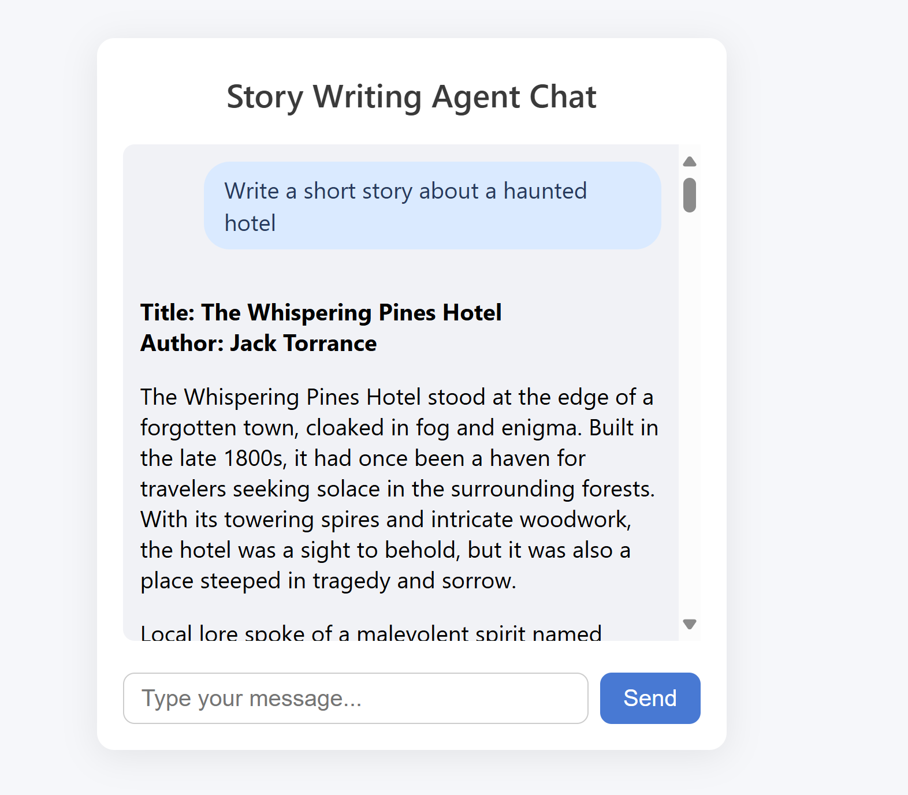
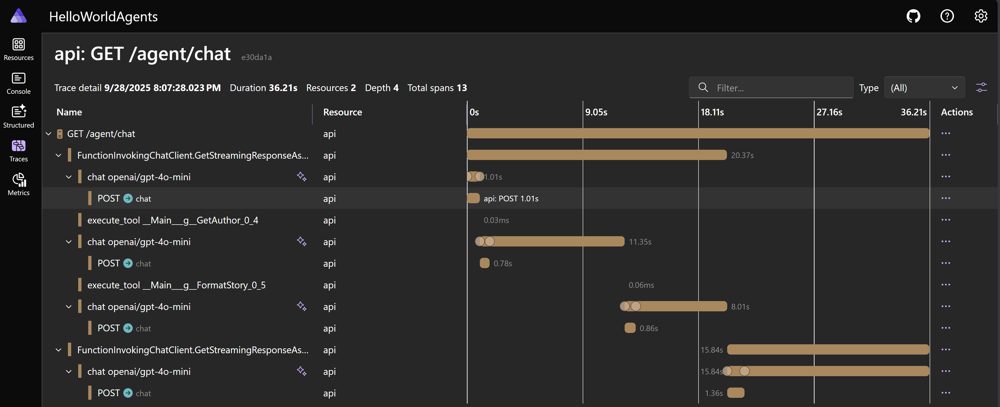
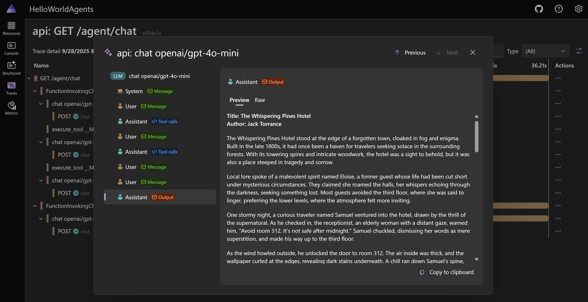

# Hello World Agents

A sample application demonstrating AI agent workflows using Microsoft Agent Framework. This project showcases how to build collaborative AI agents that work together to create and edit stories.



## Overview

This application demonstrates a multi-agent system with two specialized AI agents:

- **Writer Agent**: Creates engaging and creative stories based on prompts
- **Editor Agent**: Reviews and improves the writer's drafts with recommendations and revisions

The agents collaborate using workflow orchestration to produce high-quality creative content.

## Quick Start (Recommended)

Get started instantly with GitHub Codespaces - a fully configured development environment in the cloud:

[](https://codespaces.new/luisquintanilla/hello-world-agents?devcontainer_path=.devcontainer.json)

This will create a new codespace with all dependencies pre-installed and configured, including:

- .NET 9.0 SDK
- Docker support
- .NET Aspire tooling
- Git integration

Once your codespace is ready, you can immediately start building and running the agents!

## Project Structure

```
├── src/
│   ├── HelloWorldAgents.API/          # Web API with agent endpoints
│   │   └── wwwroot/                   # Static web chat UI files (only used for testing)
│   ├── HelloWorldAgents.AppHost/      # .NET Aspire orchestrator
│   ├── HelloWorldAgents.Console/      # Console application example
│   └── HelloWorldAgents.ServiceDefaults/ # Shared service configurations
└── hello-world-agents.slnx           # Solution file
```

## Features

- **Multi-Agent Workflows**: Demonstrates sequential and group chat patterns
- **Tool Integration**: Agents can use custom tools for formatting and data retrieval
- **GitHub Models**: Supports GitHub Models for LLMs
- **Web Chat UI**: Interactive JavaScript chat interface with Markdown rendering
- **Web API**: RESTful endpoint for agent interactions
- **Console App**: Direct agent interaction example
- **Aspire Integration**: Cloud-ready orchestration and observability with .NET Aspire

## Prerequisites

- [.NET 9.0 SDK](https://dotnet.microsoft.com/download/dotnet/9.0)
- [Aspire CLI](https://learn.microsoft.com/dotnet/aspire/cli/overview)
- A personal access token (PAT) with the `models` scope, which you can create in [settings](https://github.com/settings/tokens). For more details, see the [GitHub documentation](https://docs.github.com/en/authentication/keeping-your-account-and-data-secure/managing-your-personal-access-tokens?source=post_page-----3474aac2c6f2---------------------------------------#creating-a-personal-access-token-classic)

## Getting Started

### Configure GitHub Token Environment Variable

> [!IMPORTANT]<br>
> If you run the sample in GitHub Codespaces you do not need to create a GitHub Token and configure it. Codespaces automatically provides one.

This project can use GitHub-hosted models. To enable access outside of Codespaces, create a GitHub Personal Access Token (PAT) with the `models` scope and expose it to the app using an environment variable named `GITHUB_TOKEN`.

Set the environment variable for your platform:

#### Windows

```powershell
setx GITHUB_TOKEN "YOUR-GITHUB-TOKEN"
# Restart your shell to pick up the value
```

#### Linux / macOS (bash/zsh):

```bash
export GITHUB_TOKEN="YOUR-GITHUB-TOKEN"
```

After setting the variable, run the application as normal. The app will detect `GITHUB_TOKEN` and use it when calling GitHub Models.

### 2. Clone and Build

```bash
git clone <repository-url>
cd hello-world-agents
dotnet restore
dotnet build
```

### 3. Run the Application

#### Run the Console Application

```bash
cd src/HelloWorldAgents.Console
dotnet run
```

#### Run the Minimal Web API

Use the Aspire CLI to orchestrate and run the Web API and related services:

```bash
aspire run
```

This will start the Aspire dashboard and all required services, including the Minimal Web AP and chat UI.

### 4. Test Minimal Web API Application

## How to Use Chat UI (Development Experience)

1. Open the .NET Aspire dashboard
1. Select the **Chat UI** URL for the api resource.

    

1. In the Chat UI, enter a prompt in the text box (i.e. "Write a short story about a haunted hotel") and select **Send**

    

## View Telemetry

1. After sending a request to the `/agents/chat` endpoint, select the **Traces** tab.
1. Select one of the traces `/agets/chat` traces.

    

1. Select the sparkle icon in the trace details to see more deatils.

    

For more details, see the [.NET Aspire Dashboard documentation](https://learn.microsoft.com/dotnet/aspire/fundamentals/dashboard/overview?tabs=bash).

## Agent Workflows

### Sequential Workflow

The console application demonstrates a sequential workflow where the Writer creates content first, then the Editor reviews and improves it.

### Group Chat Workflow

The API uses a round-robin group chat manager that allows agents to collaborate iteratively with a maximum of 2 iterations.

## Endpoints

| Endpoint | Method | Description |
|----------|--------|-------------|
| `/index.html` | GET | Interactive web chat UI (main development/testing interface) |
| `/agent/chat` | GET | Initiate agent collaboration with a prompt |

## Modify and extend the sample

### Adding New Agents

1. Create a new agent using `ChatClientAgent`
1. Define custom instructions and tools
1. Register the agent in the DI container
1. Add to workflow configuration

Example:

```csharp
builder.AddAIAgent("MyAgent", (sp, key) =>
{
    var chatClient = sp.GetRequiredService<IChatClient>();
    return new ChatClientAgent(
        chatClient,
        name: key,
        instructions: "Your agent instructions here",
        tools: [/* your tools */]
    );
});
```

### Adding Custom Tools

Agents can use custom tools defined as static methods:

```csharp
[Description("Description of what the tool does")]
string MyTool(string parameter) => "Result";
```

### Web Chat UI

The web chat interface is built with:

- **HTML/CSS/JavaScript**: Clean, responsive design
- **Marked.js**: Markdown rendering for formatted stories
- **Static file serving**: Hosted directly from the API

Files located in `src/HelloWorldAgents.API/wwwroot/`:
- `index.html`: Main chat interface
- `styles.css`: Responsive styling
- `main.js`: Chat logic and Markdown rendering

## Dependencies

- **Microsoft.Agents.Workflows**: Agent workflow orchestration
- **Microsoft.Agents.AI**: Core agent abstractions
- **Microsoft.Extensions.AI**: Core AI abstractions and GitHub Models integration

## Resources

- [Microsoft Agent Framework Documentation](https://learn.microsoft.com/dotnet/ai/)
- [.NET Aspire Documentation](https://learn.microsoft.com/dotnet/aspire/)
- [GitHub Models Documentation](https://docs.github.com/en/github-models)
- [.NET AI Documentation](https://learn.microsoft.com/dotnet/ai/)
- [Microsoft.Extensions.AI Documentation](https://learn.microsoft.com/en-us/dotnet/ai/microsoft-extensions-ai)